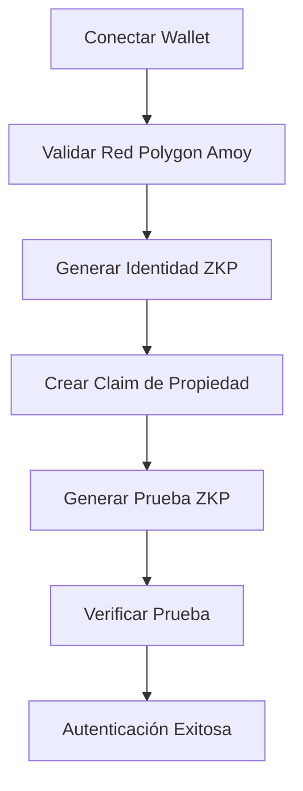
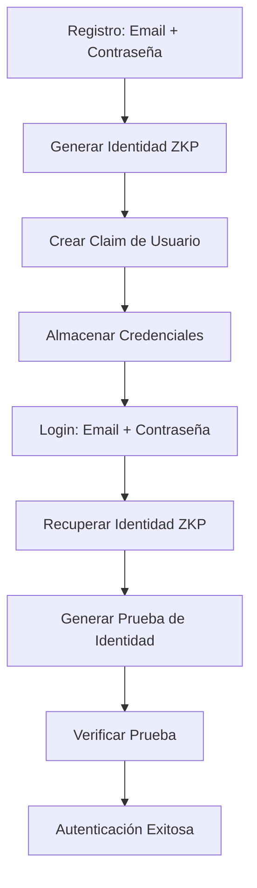

# 🔐 ZKP Login Demo - Sistema de Autenticación con Zero Knowledge Proofs

Una implementación educativa completa de un sistema de autenticación basado en Zero Knowledge Proofs (ZKP) usando PrivadoID y Polygon Amoy Testnet.

## 🎯 Objetivo del Proyecto

Este proyecto demuestra cómo implementar un sistema de autenticación moderno que combina:
- **Zero Knowledge Proofs** para privacidad y seguridad
- **Autenticación por Wallet** (MetaMask, etc.)
- **Login tradicional** con verificación ZKP
- **Identidades descentralizadas** (DIDs)
- **Claims verificables** sin revelar datos sensibles

## ✨ Características Principales

### 🔗 Autenticación por Wallet
- Conexión con MetaMask y otras wallets compatibles
- Validación automática de red (Polygon Amoy)
- Generación automática de identidad ZKP basada en la dirección
- Prueba de propiedad de wallet sin revelar claves privadas

### 👤 Autenticación Tradicional
- Registro con email/contraseña + generación de identidad ZKP
- Login con verificación ZKP personalizada
- Claims verificables con información del usuario
- Identidades determinísticas y reproducibles

### 🔒 Componentes ZKP Educativos
- **ZKPGenerator**: Generación visual de pruebas paso a paso
- **ZKPVerifier**: Verificación criptográfica con logs detallados
- **CredentialManager**: Gestión completa de identidades y claims
- Tooltips y explicaciones educativas en cada proceso

### 🎨 Interfaz de Usuario
- Diseño moderno con CSS Custom Properties (CSS Variables)
- Componentes reutilizables (Button, Input, Modal)
- Sistema de colores consistente con variables CSS
- Estados de loading y progreso visual
- Manejo robusto de errores
- Responsive design sin dependencias externas

## 🚀 Instalación y Configuración

### Prerrequisitos
- Node.js 16+ y npm
- MetaMask u otra wallet compatible
- Acceso a Polygon Amoy Testnet

### Instalación
```bash
# Clonar el repositorio
git clone [tu-repo-url]
cd login-basico-zkp

# Instalar dependencias
npm install

# Configurar variables de entorno
cp .env.example .env
# Editar .env con tu configuración de PrivadoID
```

### Configuración de PrivadoID

1. **Configurar PrivadoID Local** (Simulación)
   ```bash
   # El proyecto incluye una simulación de PrivadoID
   # No requiere setup adicional para propósitos educativos
   ```

2. **Para PrivadoID Real** (Avanzado)
   ```bash
   # Seguir la documentación oficial de PrivadoID
   # Configurar issuer y verifier locales
   # Actualizar .env con URLs y DIDs reales
   ```

3. **Variables de Entorno**
   ```env
   REACT_APP_ISSUER_DID=did:iden3:polygon:amoy:your-issuer-did-here
   REACT_APP_SCHEMA_URL=https://raw.githubusercontent.com/your-repo/schema.json
   REACT_APP_CIRCUIT_ID=credentialAtomicQuerySigV2
   REACT_APP_ISSUER_URL=http://localhost:3001
   REACT_APP_VERIFIER_URL=http://localhost:3002
   ```

### Configuración de Wallet

1. **Instalar MetaMask**
2. **Agregar Polygon Amoy Testnet**:
   - Network Name: `Polygon Amoy Testnet`
   - RPC URL: `https://rpc-amoy.polygon.technology/`
   - Chain ID: `80002`
   - Currency Symbol: `MATIC`
   - Block Explorer: `https://amoy.polygonscan.com/`

3. **Obtener MATIC de prueba**: [Polygon Faucet](https://faucet.polygon.technology/)

## 🏃‍♂️ Ejecución

```bash
# Desarrollo
npm start
# Abre http://localhost:3000

# Producción
npm run build
npm install -g serve
serve -s build
```

## 📁 Estructura del Proyecto

```
src/
├── components/
│   ├── auth/                    # Componentes de autenticación
│   │   ├── LoginContainer.jsx   # Contenedor principal
│   │   ├── WalletLogin.jsx      # Autenticación por wallet
│   │   ├── TraditionalLogin.jsx # Login tradicional
│   │   ├── RegisterForm.jsx     # Formulario de registro
│   │   └── AuthStatus.jsx       # Estado de usuario autenticado
│   ├── zkp/                     # Componentes ZKP educativos
│   │   ├── ZKPGenerator.jsx     # Generador de pruebas
│   │   ├── ZKPVerifier.jsx      # Verificador de pruebas
│   │   └── CredentialManager.jsx # Gestor de credenciales
│   └── ui/                      # Componentes UI reutilizables
│       ├── Button.jsx
│       ├── Input.jsx
│       └── Modal.jsx
├── hooks/                       # Hooks personalizados
│   ├── useWallet.js            # Manejo de wallet
│   ├── useZKP.js               # Operaciones ZKP
│   └── useAuth.js              # Autenticación completa
├── services/                    # Servicios del sistema
│   ├── privadoService.js       # Integración PrivadoID
│   ├── walletService.js        # Conexión de wallets
│   └── authService.js          # Lógica de autenticación
├── utils/                       # Utilidades
│   ├── constants.js            # Constantes del sistema
│   └── zkpUtils.js             # Funciones auxiliares ZKP
└── App.js                      # Aplicación principal
```

## 🔧 Flujos de Autenticación

### Flujo 1: Autenticación por Wallet


### Flujo 2: Autenticación Tradicional


## 🧩 Componentes Clave

### LoginContainer
Componente principal que orquesta todo el flujo de autenticación.
```jsx
<LoginContainer
  onAuthSuccess={(result) => console.log('Autenticado:', result)}
  onAuthError={(error) => console.error('Error:', error)}
  showEducationalContent={true}
/>
```

### WalletLogin
Maneja la autenticación por wallet con ZKP.
```jsx
<WalletLogin
  onAuthSuccess={handleSuccess}
  onAuthError={handleError}
  showEducationalContent={true}
/>
```

### ZKPGenerator
Genera pruebas ZKP de forma educativa.
```jsx
<ZKPGenerator
  identity={zkpIdentity}
  claim={userClaim}
  onProofGenerated={handleProofGenerated}
  showEducationalContent={true}
/>
```

## 🎓 Conceptos Educativos

### Zero Knowledge Proofs (ZKP)
Las ZKP permiten demostrar que conoces un secreto sin revelarlo. En este proyecto:
- **Prover**: Genera una prueba de que posee cierta información
- **Verifier**: Valida la prueba sin conocer la información original
- **Witness**: Los datos privados que se quieren probar
- **Public Signals**: Información pública necesaria para la verificación

### Identidades Descentralizadas (DIDs)
```
did:iden3:polygon:amoy:x8u4r2k3j9m7n6b5v8c9x2z4a6s8d1f3g5h7j9k2
```
- **Método**: `iden3` (implementación de PrivadoID)
- **Red**: `polygon:amoy` (Polygon Amoy Testnet)
- **Identificador**: Hash único derivado de los datos del usuario

### Claims Verificables
Claims son afirmaciones sobre una identidad:
```json
{
  "type": "wallet_owner",
  "subject": "did:iden3:...",
  "data": {
    "walletAddress": "0x...",
    "network": 80002
  }
}
```

## 🛠️ Personalización

### Agregar Nuevos Tipos de Claims
1. Definir en `constants.js`:
```javascript
export const CUSTOM_CLAIMS = {
  AGE_VERIFICATION: 'age_verification',
  LOCATION_PROOF: 'location_proof'
};
```

2. Implementar en `privadoService.js`:
```javascript
async function createAgeVerificationClaim(identity, birthDate) {
  // Lógica personalizada
}
```

### Personalizar Estilos
El proyecto usa CSS Custom Properties con un sistema modular:
```css
/* Variables CSS en :root */
:root {
  --primary-500: #3b82f6;
  --zkp-500: #8b5cf6;
  --gray-900: #111827;
}

/* Clases de componentes */
.zkp-card {
  background-color: white;
  box-shadow: 0 10px 15px -3px rgba(0, 0, 0, 0.1);
  border-radius: 0.5rem;
  padding: 1.5rem;
  border: 1px solid var(--gray-200);
}
```

### Agregar Nuevas Redes
1. Definir en `constants.js`:
```javascript
export const NETWORKS = {
  // ... redes existentes
  ETHEREUM_SEPOLIA: {
    chainId: 11155111,
    name: 'Ethereum Sepolia',
    // ... configuración
  }
};
```

## 🐛 Solución de Problemas

### Error: Wallet no conectada
- Verificar que MetaMask esté instalado
- Asegurar que el sitio tenga permisos
- Verificar que la wallet esté desbloqueada

### Error: Red incorrecta
- Cambiar a Polygon Amoy en MetaMask
- Verificar configuración de red
- Intentar agregar la red manualmente

### Error: PrivadoID service unavailable
- Verificar configuración en `.env`
- En modo simulación: normal (funciona offline)
- En modo real: verificar servicios locales

### Error: ZKP generation failed
- Verificar que los datos de entrada sean válidos
- Revisar logs en la consola del navegador
- Verificar configuración de circuitos

## 📚 Recursos Adicionales

### Documentación
- [PrivadoID Documentation](https://docs.privado.id/)
- [Polygon Documentation](https://docs.polygon.technology/)
- [Zero Knowledge Proofs](https://z.cash/technology/zksnarks/)

### Tutoriales
- [Getting Started with PrivadoID](https://docs.privado.id/docs/getting-started)
- [Polygon Development](https://docs.polygon.technology/develop/)
- [React Hooks Guide](https://reactjs.org/docs/hooks-intro.html)

## 🤝 Contribuir

1. Fork el proyecto
2. Crear branch para tu feature (`git checkout -b feature/AmazingFeature`)
3. Commit tus cambios (`git commit -m 'Add some AmazingFeature'`)
4. Push al branch (`git push origin feature/AmazingFeature`)
5. Abrir un Pull Request

## 📄 Licencia

Este proyecto está bajo la Licencia MIT - ver el archivo [LICENSE](LICENSE) para detalles.

## ⚠️ Disclaimer

**Este es un proyecto educativo.** No usar en producción sin:
- Auditorías de seguridad completas
- Configuración robusta de PrivadoID
- Implementación de mejores prácticas de seguridad
- Testing exhaustivo
- Infraestructura de producción adecuada

## 👥 Autor

Creado con ❤️ para aprender y enseñar Zero Knowledge Proofs.

---

**¿Preguntas?** Abre un issue o consulta la documentación de los proyectos relacionados.

### Code Splitting

This section has moved here: [https://facebook.github.io/create-react-app/docs/code-splitting](https://facebook.github.io/create-react-app/docs/code-splitting)

### Analyzing the Bundle Size

This section has moved here: [https://facebook.github.io/create-react-app/docs/analyzing-the-bundle-size](https://facebook.github.io/create-react-app/docs/analyzing-the-bundle-size)

### Making a Progressive Web App

This section has moved here: [https://facebook.github.io/create-react-app/docs/making-a-progressive-web-app](https://facebook.github.io/create-react-app/docs/making-a-progressive-web-app)

### Advanced Configuration

This section has moved here: [https://facebook.github.io/create-react-app/docs/advanced-configuration](https://facebook.github.io/create-react-app/docs/advanced-configuration)

### Deployment

This section has moved here: [https://facebook.github.io/create-react-app/docs/deployment](https://facebook.github.io/create-react-app/docs/deployment)

### `npm run build` fails to minify

This section has moved here: [https://facebook.github.io/create-react-app/docs/troubleshooting#npm-run-build-fails-to-minify](https://facebook.github.io/create-react-app/docs/troubleshooting#npm-run-build-fails-to-minify)
