# 🔐 ZKP - Sistema de Autenticación con Zero Knowledge Proofs

Una implementación educativa completa de un sistema de autenticación basado en Zero Knowledge Proofs (ZKP) usando PrivadoID y Polygon Amoy Testnet.

##  Características Principales

### Autenticación por Wallet
- Conexión con MetaMask y otras wallets compatibles
- Validación automática de red (Polygon Amoy)
- Generación automática de identidad ZKP basada en la dirección
- Prueba de propiedad de wallet sin revelar claves privadas

###  Autenticación Tradicional
- Registro con email/contraseña + generación de identidad ZKP
- Login con verificación ZKP personalizada
- Claims verificables con información del usuario
- Identidades determinísticas y reproducibles

##  Instalación y Configuración

### Prerrequisitos
- Node.js 16+ y npm
- MetaMask u otra wallet compatible
- Acceso a Polygon Amoy Testnet

### Instalación
```bash
# Clonar el repositorio
git clone [tu-repo-url]
cd login-basico-zkp

# Instalar dependencias
npm install

# Configurar variables de entorno
cp .env.example .env
# Editar .env con tu configuración de PrivadoID
```

### Configuración de PrivadoID

1. **Configurar PrivadoID Local** (Simulación)
   ```bash
   # El proyecto incluye una simulación de PrivadoID
   # No requiere setup adicional para propósitos educativos
   ```

2. **Para PrivadoID Real** (Avanzado)
   ```bash
   # Seguir la documentación oficial de PrivadoID
   # Configurar issuer y verifier locales
   # Actualizar .env con URLs y DIDs reales
   ```

3. **Variables de Entorno**
   ```env
   REACT_APP_ISSUER_DID=did:iden3:polygon:amoy:your-issuer-did-here
   REACT_APP_SCHEMA_URL=https://raw.githubusercontent.com/your-repo/schema.json
   REACT_APP_CIRCUIT_ID=credentialAtomicQuerySigV2
   REACT_APP_ISSUER_URL=http://localhost:3001
   REACT_APP_VERIFIER_URL=http://localhost:3002
   ```

### Configuración de Wallet

1. **Instalar MetaMask**
2. **Agregar Polygon Amoy Testnet**:
   - Network Name: `Polygon Amoy Testnet`
   - RPC URL: `https://rpc-amoy.polygon.technology/`
   - Chain ID: `80002`
   - Currency Symbol: `MATIC`
   - Block Explorer: `https://amoy.polygonscan.com/`

3. **Obtener MATIC de prueba**: [Polygon Faucet](https://faucet.polygon.technology/)

## 🏃‍♂️ Ejecución

```bash
# Desarrollo
npm start
# Abre http://localhost:3000

# Producción
npm run build
npm install -g serve
serve -s build
```

## 📁 Estructura del Proyecto

```
src/
├── components/
│   ├── auth/                    # Componentes de autenticación
│   │   ├── LoginContainer.jsx   # Contenedor principal
│   │   ├── WalletLogin.jsx      # Autenticación por wallet
│   │   ├── TraditionalLogin.jsx # Login tradicional
│   │   ├── RegisterForm.jsx     # Formulario de registro
│   │   └── AuthStatus.jsx       # Estado de usuario autenticado
│   ├── zkp/                     # Componentes ZKP educativos
│   │   ├── ZKPGenerator.jsx     # Generador de pruebas
│   │   ├── ZKPVerifier.jsx      # Verificador de pruebas
│   │   └── CredentialManager.jsx # Gestor de credenciales
│   └── ui/                      # Componentes UI reutilizables
│       ├── Button.jsx
│       ├── Input.jsx
│       └── Modal.jsx
├── hooks/                       # Hooks personalizados
│   ├── useWallet.js            # Manejo de wallet
│   ├── useZKP.js               # Operaciones ZKP
│   └── useAuth.js              # Autenticación completa
├── services/                    # Servicios del sistema
│   ├── privadoService.js       # Integración PrivadoID
│   ├── walletService.js        # Conexión de wallets
│   └── authService.js          # Lógica de autenticación
├── utils/                       # Utilidades
│   ├── constants.js            # Constantes del sistema
│   └── zkpUtils.js             # Funciones auxiliares ZKP
└── App.js                      # Aplicación principal
```

## 🔧 Flujos de Autenticación

### Flujo 1: Autenticación por Wallet


### Flujo 2: Autenticación Tradicional

```mermaid
graph TD
    A[Registro: Email + Contraseña] --> B[Generar Identidad ZKP]
    B --> C[Crear Claim de Usuario]
    C --> D[Almacenar Credenciales]
    D --> E[Login: Email + Contraseña]
    E --> F[Recuperar Identidad ZKP]
    F --> G[Generar Prueba de Identidad]
    G --> H[Verificar Prueba]
    H --> I[Autenticación Exitosa]
```


## Componentes Clave

### LoginContainer
Componente principal que orquesta todo el flujo de autenticación.
```jsx
<LoginContainer
  onAuthSuccess={(result) => console.log('Autenticado:', result)}
  onAuthError={(error) => console.error('Error:', error)}
  showEducationalContent={true}
/>
```

### WalletLogin
Maneja la autenticación por wallet con ZKP.
```jsx
<WalletLogin
  onAuthSuccess={handleSuccess}
  onAuthError={handleError}
  showEducationalContent={true}
/>
```

### ZKPGenerator
Genera pruebas ZKP de forma educativa.
```jsx
<ZKPGenerator
  identity={zkpIdentity}
  claim={userClaim}
  onProofGenerated={handleProofGenerated}
  showEducationalContent={true}
/>
```

### Identidades Descentralizadas (DIDs)
```
did:iden3:polygon:amoy:x8u4r2k3j9m7n6b5v8c9x2z4a6s8d1f3g5h7j9k2
```
- **Método**: `iden3` (implementación de PrivadoID)
- **Red**: `polygon:amoy` (Polygon Amoy Testnet)
- **Identificador**: Hash único derivado de los datos del usuario

### Claims Verificables
Claims son afirmaciones sobre una identidad:
```json
{
  "type": "wallet_owner",
  "subject": "did:iden3:...",
  "data": {
    "walletAddress": "0x...",
    "network": 80002
  }
}
```

## 🛠️ Personalización

### Agregar Nuevos Tipos de Claims
1. Definir en `constants.js`:
```javascript
export const CUSTOM_CLAIMS = {
  AGE_VERIFICATION: 'age_verification',
  LOCATION_PROOF: 'location_proof'
};
```

2. Implementar en `privadoService.js`:
```javascript
async function createAgeVerificationClaim(identity, birthDate) {
  // Lógica personalizada
}
```

### Personalizar Estilos
El proyecto usa CSS Custom Properties con un sistema modular:
```css
/* Variables CSS en :root */
:root {
  --primary-500: #3b82f6;
  --zkp-500: #8b5cf6;
  --gray-900: #111827;
}

/* Clases de componentes */
.zkp-card {
  background-color: white;
  box-shadow: 0 10px 15px -3px rgba(0, 0, 0, 0.1);
  border-radius: 0.5rem;
  padding: 1.5rem;
  border: 1px solid var(--gray-200);
}
```

### Agregar Nuevas Redes
1. Definir en `constants.js`:
```javascript
export const NETWORKS = {
  // ... redes existentes
  ETHEREUM_SEPOLIA: {
    chainId: 11155111,
    name: 'Ethereum Sepolia',
    // ... configuración
  }
};
```

### Error: PrivadoID service unavailable
- Verificar configuración en `.env`
- En modo simulación: normal (funciona offline)
- En modo real: verificar servicios locales

### Error: ZKP generation failed
- Verificar que los datos de entrada sean válidos
- Revisar logs en la consola del navegador
- Verificar configuración de circuitos

## Recursos Adicionales

### Documentación
- [PrivadoID Documentation](https://docs.privado.id/)
- [Polygon Documentation](https://docs.polygon.technology/)
- [Zero Knowledge Proofs](https://z.cash/technology/zksnarks/)
